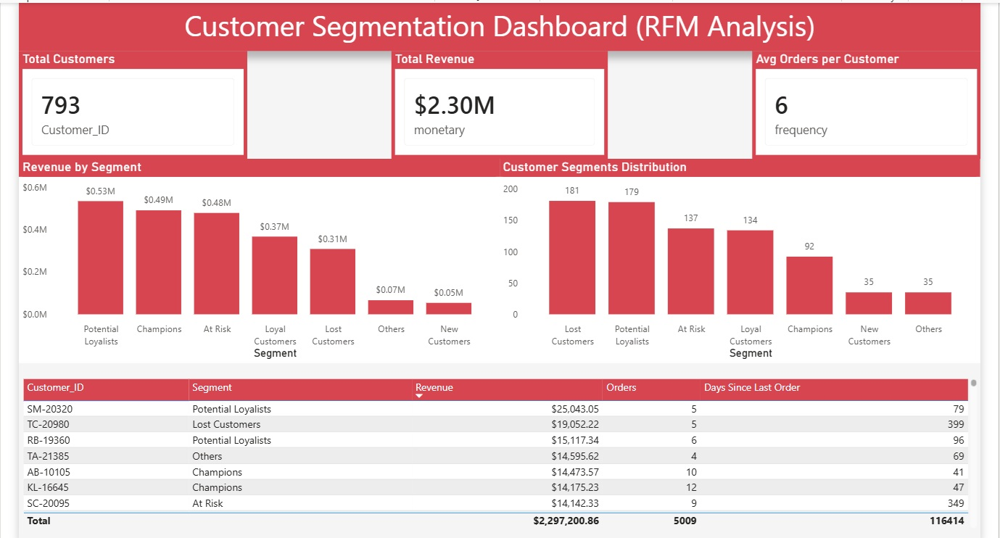

# 📊 Customer Segmentation using RFM Analysis

## 📌 Project Overview

This project performs **RFM (Recency, Frequency, Monetary) analysis** to segment customers based on their purchasing behavior.
The goal is to identify high-value customers, detect churn patterns, and support data-driven marketing strategies.

---

## 🎯 Objectives

* Analyze customer behavior using transactional data
* Identify high-value and low-value customer segments
* Detect at-risk and lost customers
* Support targeted marketing and retention strategies

---

## 📂 Dataset

* Source: Superstore Dataset
* Data includes:

  * Customer ID
  * Order ID
  * Order Date
  * Sales

---

## 🛠️ Tools Used

* SQL Server
* Power BI

---

## 🔄 Data Processing Steps

### 1. Data Preparation

* Aggregated data at **order level**
* Calculated total revenue per order

### 2. RFM Calculation

* **Recency** → Days since last purchase
* **Frequency** → Number of orders
* **Monetary** → Total spending

### 3. Scoring

* Used `NTILE(5)` to assign scores (1–5)
* Higher score = better customer value

### 4. Segmentation

Customers were classified into:

* Champions
* Loyal Customers
* Potential Loyalists
* New Customers
* At Risk
* Lost Customers

---

## 📊 Dashboard

### Key Metrics:

* Total Customers
* Total Revenue
* Average Orders per Customer

### Visuals:

* Customer Segments Distribution
* Revenue by Segment
* Customer Details Table

---

## 🔍 Key Insights

* A small group of customers (Champions) generates a large portion of total revenue
* Not all customers contribute equally to business value
* A significant number of customers are classified as **Lost**, indicating retention issues
* **At Risk** customers represent an opportunity for re-engagement

---

## 💡 Business Recommendations

* Focus on retaining high-value customers (Champions)
* Launch re-engagement campaigns for At Risk customers
* Improve post-purchase experience to reduce churn
* Analyze successful customer behavior and replicate it

---

## 📸 Dashboard Preview

---

## 🚀 Project Outcome

This project demonstrates the ability to:

* Perform advanced SQL analysis
* Apply business-oriented segmentation techniques
* Build interactive dashboards in Power BI
* Translate data into actionable insights

---
